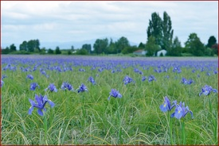
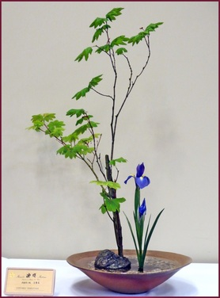

# Ikenobo Ikebana

Ikebana as an art form began in Japan as a result of continuing efforts by Buddhist priests to reflect the harmony of nature in a man-made setting. The art now stands by itself outside the original religious setting, but continues to pursue the objective of expressing the beauty of nature. The secular art has branched into many schools, or disciplines, over the years and has spread around the world, as people of other countries became interested in Ikebana.

The history of Ikenobo is the history of ikebana. Although other schools have since branched off, Ikenobo, celebrating 550 years of recorded history in 2012, is still considered to be the origin of ikebana. Ikenobo history encompasses both the traditional and the modern, the two continually interacting to encourage new development in today’s ikebana. People in every era have loved flowers, but our predecessors in ikebana felt that flowers were not only beautiful but that they could reflect the passing of time and the feelings in their own hearts. When we sense plants’ unspoken words and silent movements, we intensify our impressions through form and that form becomes ikebana.

We arrange plants cut and removed from nature so that they are filled with new beauty when placed in a new environment. Rather than simply recreating the shape a plant had in nature, we create with branches, leaves, and flowers a new form which holds our impression of a plant’s beauty as well as the mark of our own spirit. Ikebana should also suggest the forces of nature with which plants live in harmony – branches bent by winter winds…a leaf half eaten by insects.

Ikenobo considers a flower’s bud most beautiful, for with the bud is the energy of life’s opening toward the future. Past, present, future…in each moment, plants and humans respond to an ever-changing environment. Together with plants, humans are vital parts of nature and our arranging ikebana expresses this awareness.

Like a poem or painting made with flowers, Ikenobo ikebana expresses both the beauty of flowers and the beauty of longing in our own hearts. Ikenobo spirit has spread not only in Japan but throughout the world. It is our deepest hope that the beauty of Ikenobo will increasingly serve as a way of drawing the world’s people together.

