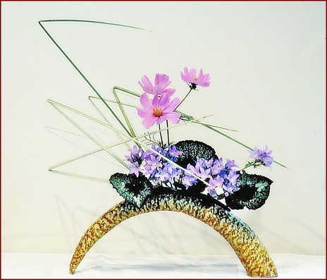
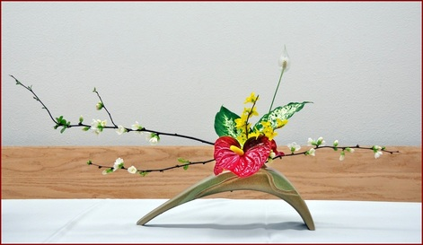

# Free Style

Free Style is the most recent to emerge from Ikenobo's long tradition. As a more personal expression, it is suited to contemporary enviroments and tastes.

Free style is sometimes broadly divided into a naturalistic style and a more abstract style. Both styles use plant materials in new ways, yet respect the beauty and essential qualities of each material.

Flowing from the arranger's inventiveness in using materials to convey an effect or mood, free style's possibilities are unlimited.

