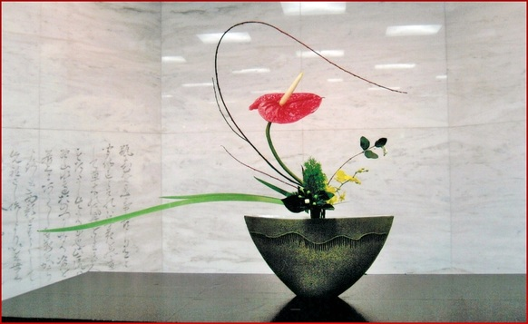
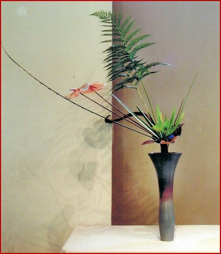

# Rikka

Rikka’s origin lies in the 16th century tatehana style. Reaching full flower in the 17th century under Headmaster Ikenobo Senko II, Rikka is the source of all later Ikenobo styles. Study continues today of both the traditional Rikka Shofutai style and the new Rikka Shimputai style developed by the present Headmaster, Sen’ei Ikenobo.

Rikka’s basic parts are arranged with many contrasting but complimentary materials, expressing the beauty of a natural landscape. Hidden within the principles of this most representative of ikebana styles is surprisingly fertile ground for variation and adaptation to contemporary environments.

*Rikka Shofutai*
{: .image-caption}

*Rikka Shimputai*
{: .image-caption}

