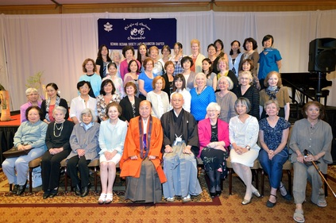
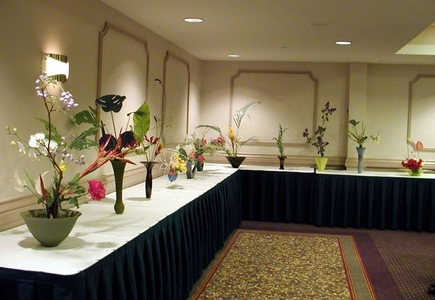
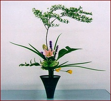
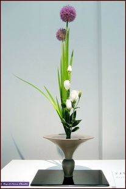
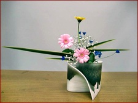

# Welcome!

*Headmaster Sen’ei Ikenobo with Chapter Members - July 2012*
{: .image-caption}

We invite you to learn about our Chapter and our passion for Ikenobo Ikebana, the original school of Japanese flower arrangement.

*Please note that all Ikebana photos included on this website are of Ikenobo Ikebana done at our Chapter or by our Chapter members when participating in other exhibitions.*

*Founding Celebration Exhibition - 2002*
{: .image-caption}

The Ikenobo Lake Washington Chapter is a non-profit organization certified as an Ikenobo Chapter by Headmaster Sen’ei Ikenobo, the 45th successive Headmaster of the Ikenobo Ikebana Society in Kyoto, Japan.

Our mission is to learn and communicate knowledge of the traditional and modern art forms of the Ikenobo Ikebana Society.

Our Chapter members learn the art of Ikenobo Ikebana from lectures and workshops conducted by Visiting Professors from Kyoto and through study with local Professors that have been certified by the Ikenobo Ikebana Society headquarters in Kyoto, Japan.

We communicate our art form through demonstrations and exhibitions at area cultural venues and community events.

Our Chapter currently has more than 30 members. Chapter Officers are: Ms. Sharon Chong, President; Ms. Nataliya Husar, Vice President; Mrs. Hyun Son Shin, Secretary; Ms. Qiong Chen, Treasurer.

**Recent website additions:** Click here for photos of the [September 2023 Ikebana Exhibition](Gallery/2023-09-01.Kirkland_Exhibition/) at the Kirkland Library.

| | | |
|:---:|:---:|:---:|
|  |  |  |
| *Rikka Style* | *Shoka Style* | *Freestyle* |
